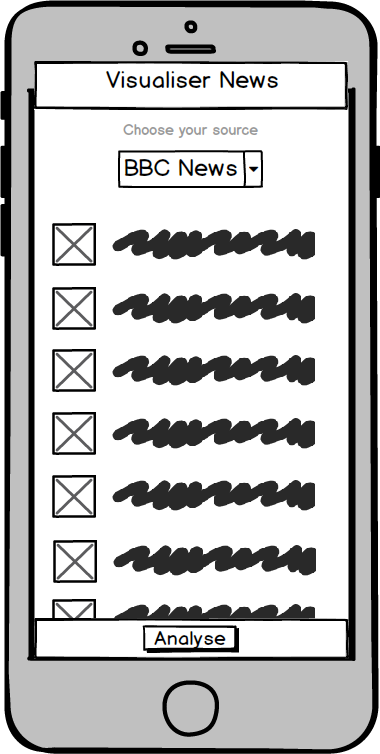

# News Analysis API
The aim of our api is to take the top ten news headlines from [News API](https://newsapi.org) and pass these to [Text Razor](https://www.textrazor.com), which will return a category analysis of each headline. Using the data returned from News Razor, we'll create an inforgraphic (probably a pie chart) that shows the emphasis of the news by category.

## Product
#### MVP
- Mobile-first, modular design
- User can click buttons or menu items that say 'get the news' or 'analyse the news'
- 'Get the news' would return headline links to news features
- 'Analyse the news' would return the infographic

#### Wireframes
- Mobile-first landing page

- Mobile-first landing page with expanded headlines content

- Mobile-first infographic page

- Desktop landing page

#### Bonus
- Analysis of the category emphasis of individual publications (eg Guardian, BBC, Telegraph, Daily Mail)
- User can click button to translate news into 'talk like a pirate'
- Geo-location using IP to localise news headlines

## Methodology
#### MVP
- Use more than one API
- Responsive design
- TDD (Look into stubbing/mocking functions to help test API requests)
- Dynamic content
- No API keys pushed to github
- Minimise DOM manipulation (expensive!)
- DRY code (refactor to function calls)
- Everyone on the team must write at least one test

#### Bonus
- Mobile first
- Nice design (CSS)
- Use local storage or session storage
